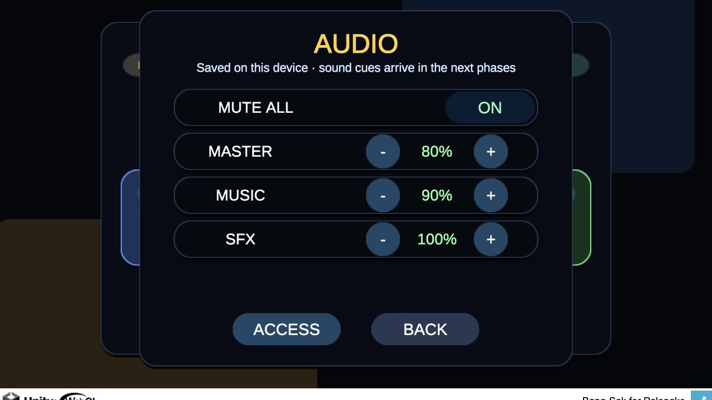
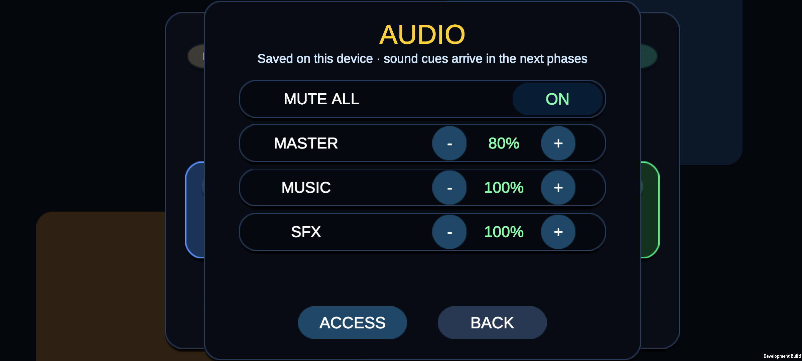

# Phase 35B — Audio settings controls

## Status

Implemented and awaiting explicit owner visual approval. Do not begin Phase 35C
until that approval is recorded.

Google Play Phase 34J remains open as an independent external distribution gate.
This phase does not alter Play Console state or authorize Phase 34K.

## Goal

Expose the Phase 35A preferences through one focused, touch-safe audio page
without adding any sound asset or gameplay cue.

## Included

- an `AUDIO` entry from the existing Accessibility settings page;
- a separate Audio page so the existing controls are not crowded;
- one `MUTE ALL` toggle;
- independent master, music, and SFX percentage displays;
- 10% decrement/increment buttons for each level;
- navigation back to Accessibility or the main menu;
- immediate persistence through the Phase 35A settings layer.

## Explicitly excluded

- music, ambient sound, or sound-effect assets;
- menu, Bang, SAK, reveal, pickup, or result cues;
- scene/gameplay/Photon/API behavior changes;
- production deployment, Play upload, or public rollout.

## Acceptance evidence

1. All nine interactive Audio-page controls meet the automated minimum target:
   at least `44 px` wide and `42 px` high.
2. Audio opens without leaving Accessibility active underneath and can return to
   Accessibility or close to the main menu.
3. Mute and all three levels update the persisted Phase 35A settings.
4. The three percentage labels update independently in 10% steps.
5. The final Unity `2022.3.50f1` EditMode suite passed:
   `246 passed, 0 failed, 0 skipped`, including four focused Phase 35B tests.
6. A fresh WebGL build was exercised at `1280×720`; mute and percentages
   responded correctly with no overlap or missing glyph.
7. A fresh Android ARM64 debug build was installed on the Pixel 6 API 35
   emulator at `2400×1080`; the Audio page fit the landscape safe area and
   touch input changed mute and master independently.

## Visual review

Desktop WebGL after changing mute, master, and music:

Android reference emulator after changing mute and master:

## Approval gate

The owner must approve the two screenshots. If approved, close Phase 35B and
continue to Phase 35C menu/interface cues. If changes are requested, revise and
repeat both visual checks before continuing.
